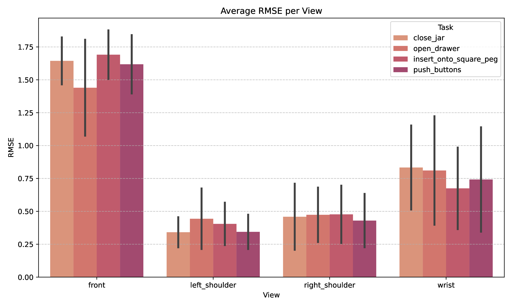

# Enhancing Few-Shot Robotic Manipulation by Replacing Depth Sensors with Learned 3D Geometry from MASt3R

This project investigates a fundamental challenge in robotic manipulation: the dependency on expensive RGB-D sensors for accurate 3D spatial understanding. We explore whether [MASt3R](https://europe.naverlabs.com/blog/mast3r-matching-and-stereo-3d-reconstruction/) (Matching And Stereo 3D Reconstruction), a 3D reconstruction method that works with RGB images alone, can effectively replace traditional depth sensors in robotic manipulation pipelines, by integrating depthmaps created using MASt3R with [RVT-2](https://robotic-view-transformer-2.github.io/) (Robotic Vision Transformer).

Recovering 3D structure from uncalibrated images is fundamental to computer vision and robotics, with traditional multi-view stereo (MVS) methods like SIFT suffering from limitations under wide viewpoint changes and textureless surfaces. Recent learning-based approaches such as DUSt3R address these issues by treating image correspondence as a 3D prediction task through transformer-based pipelines. MASt3R builds upon this foundation with dense local features and modified ViT backbones, achieving state-of-the-art performance on benchmarks like [DTU](https://roboimagedata.compute.dtu.dk/?page_id=36) with particular robustness under challenging conditions. Meanwhile, vision-based robotic manipulation typically relies on expensive calibrated RGB-D sensors for 3D spatial perception. While systems like RVT-2 have reduced supervision requirements through transformer architectures that fuse multi-view features for manipulation tasks, they still depend on high-quality depth information.  While prior work has explored depth fusion or SLAM-based integration for perception, few systems have attempted to replace depth sensors entirely using learned geometry from raw RGB. This is particularly relevant in settings where depth sensors are impractical due to lighting, range, or surface properties.

**Authors:** Ruben Figge, Sjoerd Gunneweg, Jurgen de Heus, Mees Lindeman  
<a href="https://www.uva.nl"> </a>**University of Amsterdam** 


## Table of Contents

- [Strengths and Weaknesses](#strengths-and-weaknesses)
  - [Strengths of MASt3R](#strengths-of-mast3r)
  - [Identified Weaknesses](#identified-weaknesses)
- [Novel contributions](#novel-contributions)
- [Results](#results)
  - [MASt3R Reproducibility (DTU Dataset)](#mast3r-reproducibility-dtu-dataset)
  - [Depth Map Quality Assessment (RLBench)](#depth-map-quality-assessment-rlbench)
  - [RVT-2 Integration Results](#rvt-2-integration-results)
- [Reproducing Results](#reproducing-results)
  - [Getting started:](#getting-started)
  - [Reproduction of MASt3R evaluation on the DTU dataset](#reproduction-of-mast3r-evaluation-on-the-dtu-dataset)
  - [Generating and Benchmarking the depthmaps estimated using MASt3R on RLBench](#generating-and-benchmarking-the-depthmaps-estimated-using-mast3r-on-rlbench)
  - [RVT-2](#rvt-2)
- [Conclusion](#conclusion)
- [Description of each students contribution](#description-of-each-students-contribution)
- [Acknowledgement](#acknowledgement)


## Strengths and Weaknesses

### Strengths of MASt3R
- **Hardware Independence:** Eliminates the need for expensive RGB-D sensors and complex calibration procedures
- **Robustness:** Demonstrates strong performance under large baselines and low-texture scenes

### Identified Weaknesses
- **Untested in Robotic Contexts:** MASt3R had only been evaluated on traditional computer vision benchmarks (DTU, Map-Free Localization), with no validation in real robotic manipulation scenarios
- **RVT-2's RGB-D Dependency:** Despite RVT-2's manipulation performance, it remains constrained by the requirement for expensive, calibrated RGB-D sensors
- **Cost and Accessibility Barriers:** Current state-of-the-art manipulation systems require hardware setups that are expensive for many applications

## Novel contributions

This project introduces two primary novel contributions to the field of vision-based robotic manipulation:

1. Benchmarking MASt3R on Synthetic Robotic Data <br>
We provide an evaluation of depth maps generated using the MASt3R model on the RLBench dataset. This dataset consists of synthetic, low-resolution, multi-view robotic scenes. While MASt3R has been trained on synthetic data, it has only been benchmarked on real-world datasets such as DTU; its performance on synthetic scenes remained unexplored. Our benchmarking against ground-truth RLBench depth maps extends the evaluation of MASt3R from real-world to simulated domains, revealing insights into its generalizability under reduced visual complexity, such as limited shadows, reflections, and texture variance.

2. Generalizing the RVT-2 Pipeline by Using Estimated Depth Maps <br>
The core contribution of this work lies in modifying the RVT-2 pipeline to eliminate the need for RGB-D input. We achieve this by integrating MAST3R into the pipeline as a plug-and-play depth estimation backbone, enabling RVT-2 to become a purely RGB-based system. To the best of our knowledge, this is the first demonstration of RVT-2 functioning without ground-truth depth information, relying instead on learned 3D geometry from uncalibrated RGB inputs. This significantly reduces hardware requirements, offering a viable path towards scalable and sensor-light robotic training systems.

In combination, these contributions bridge the gap between state-of-the-art 3D reconstruction methods and practical robotic control pipelines, paving the way for future systems that learn manipulation skills in sensor-limited environments.

## Results

### MASt3R Reproducibility (DTU Dataset)
<div align="center">

| Methods                              | Acc. ↓ | Comp. ↓ | Overall ↓ |
|--------------------------------------|--------|----------|------------|
| DUSt3R (Original Results)            | 2.677  | 0.805    | 1.741      |
| MASt3R (Original Results)            | 0.403  | 0.344    | 0.374      |
| MASt3R (Our Reproduction)            | 0.551  | 0.385    | 0.468      |

**Table:** Accuracy (Acc.), Completeness (Comp.), and Overall (Chamfer distance) scores for MASt3R evaluated on the DTU dataset. Lower is better for all metrics. Original results compared with our reproduced results.

</div>

Our MVS Results             |  Original MVS Results
:-------------------------:|:-------------------------:
 |  

**Figure:** Qualitative MVS results comparison between results obtained by us (left) and the original results from MASt3R (right)

### Depth Map Quality Assessment (RLBench)

| Average ScaleInvRMSE per view           | Average SSIM per view             |
|:------------------------:|:-------------------------:|
|  |  |
| Average AbsRel per view             | Average AbsRel per view             |
|  |  |

**Figure:** Depth Evaluation by Camera View


**Figure:** Qualitative results of depth estimation with the use of MASt3R. The scene depicted is timestep 42, episode 42 of the close\_jar training observation.

### RVT-2 Integration Results

Average Loss             |  Relative Loss
:-------------------------:|:-------------------------:
 |  

**Figure:** Average and Relative Loss for RVT-2 with MASt3R vs. Original RGB-D Input.

<div align="center">

| **Task**       | **Paper**        | **Model** | **Trained** |
|----------------|------------------|-----------|-------------|
| open_drawer    | 74.0 ± 11.8%     | 88.0%     | 72.0%       |
| close_jar      | 100.0 ± 0.0%     | 100.0%    | 100.0%      |

**Table:** Evaluation accuracy (%).

</div>

## Reproducing Results

### Getting started:
- **Step 1:** Create the environment. We recommend following the installation steps 2 and 3 specified in the README of the [MASt3R](https://europe.naverlabs.com/blog/mast3r-matching-and-stereo-3d-reconstruction/) repository for creating a conda environment.

- **Step 2:** Downloading and adding the MASt3R model checkpoints.

```bash
mkdir -p mast3r/checkpoints/

wget https://download.europe.naverlabs.com/ComputerVision/MASt3R/MASt3R_ViTLarge_BaseDecoder_512_catmlpdpt_metric.pth -P mast3r/checkpoints/

wget https://download.europe.naverlabs.com/ComputerVision/MASt3R/MASt3R_ViTLarge_BaseDecoder_512_catmlpdpt_metric_retrieval_trainingfree.pth -P mast3r/checkpoints/

wget https://download.europe.naverlabs.com/ComputerVision/MASt3R/MASt3R_ViTLarge_BaseDecoder_512_catmlpdpt_metric_retrieval_codebook.pkl -P mast3r/checkpoints/
```

- **Step 3:** Install additional packages into the conda environment. 
```bash
pip install scipy ftfy regex tqdm torch git+https://github.com/openai/CLIP.git einops pyrender==0.1.45 trimesh==3.9.34 pycollada==0.6 scikit-image
```

- **Step 4:** Download the [pre-generated observations](https://drive.google.com/drive/folders/0B2LlLwoO3nfZfkFqMEhXWkxBdjJNNndGYl9uUDQwS1pfNkNHSzFDNGwzd1NnTmlpZXR1bVE?resourcekey=0-jRw5RaXEYRLe2W6aNrNFEQ) of the [RLBench](https://github.com/stepjam/RLBench) dataset provided by [PerAct](https://github.com/peract/peract#download). Make sure the directory containing the dataset is of the following structure:
```
rlbench/
├── train/
|   └── ...
├── val/
|   └── ...
└── test/
    └── ...
```


### Reproduction of MASt3R evaluation on the DTU dataset
**TODO**


### Generating and Benchmarking the depthmaps estimated using MASt3R on RLBench
To reproduce the results of the benchmarking of the depth estimation using MASt3R on the RLBench dataset the following steps can be followed.
#### 1. Using MAST3R to predict depthmaps using the RLBench rgb images
RVT-2 uses only the following cameras: front,
left shoulder, right shoulder, and wrist. For this reason we only predict the depthmaps of these camera views. 

augmenting_rlbench_with_mast3r/augment_rlbench_with_mast3r.py is used for this.
##### Example used for reproducing the paper results
```bash
cd augmenting_rlbench_with_mast3r

python augment_rlbench_with_mast3r.py --data_path <TRAIN_DATA_FOLDER_LOCATION> --tasks close_jar insert_onto_square_peg open_drawer push_buttons

python augment_rlbench_with_mast3r.py --data_path <VAL_DATA_FOLDER_LOCATION> --tasks close_jar insert_onto_square_peg open_drawer push_buttons
```

(By default when no tasks are specified all tasks inside the provided data folder are processed.)
Note that the predicted depthmaps are saved using the same method as the RLBench depthmaps making the images not interpretable without correct processing during loading them. So do not worry when they are not looking like much.

#### 2. Evaluating the estimated depthmaps against the ground-truth depthmaps provided by RLBench
For evaluating the depthmaps the metrics mentioned in the paper are used on each of the depthmaps. The metrics are both aggregated on episode level and task level. The metrics of each timestep is stored in a structured way together with the episode and task aggregates inside a json.

augmenting_rlbench_with_mast3r/evaluate_depth_maps.py is used for this.
##### Example used for reproducing the paper results
```bash
cd augmenting_rlbench_with_mast3r

python evaluate_depth_maps.py --data_path <TRAIN_DATA_FOLDER_LOCATION> --tasks close_jar insert_onto_square_peg open_drawer push_buttons --outpath train_metrics.json 
```
### RVT-2

This repository provides containerized options to run [RVT-2](https://github.com/nvlabs/rvt) for reproducibility and easier deployment. It supports both Docker and Singularity (Apptainer), including usage on HPC systems like Snellius.

#### Setup Options

You can run RVT-2 in three different ways:

##### 1. Build Docker Image Locally
Use the provided Dockerfile to build the image:

```bash
docker build -t rvt2:latest .
```

##### 2. Use Prebuilt Docker Image
Pull and run the prebuilt image from [DockerHub](https://hub.docker.com/repository/docker/meeslindeman/rvt2/general).

```bash
docker build -t rvt2:latest .
```

##### 3. Build Singularity Image (HPC / Snellius)
Use the `rvt2build.def` file with Apptainer (formerly Singularity). For more information on using Singularity on Snellius, see [Surfdesk](https://servicedesk.surf.nl/wiki/spaces/WIKI/pages/30660251/Apptainer+formerly+Singularity).

#### Environment Setup 
This should work automatically, make sure the following environment variables are set before running the container.

```bash
export COPPELIASIM_ROOT=<PATH TO COPPELIASIM INSTALL DIR>
export LD_LIBRARY_PATH=$LD_LIBRARY_PATH:$COPPELIASIM_ROOT
export QT_QPA_PLATFORM_PLUGIN_PATH=$COPPELIASIM_ROOT
export DISPLAY=:1.0
```
#### Data & Model Setup
The dataset and pretrained model are not included in the container and must be set up manually.

##### 1. Download Dataset
Use the [pre-generated dataset](https://drive.google.com/drive/folders/0B2LlLwoO3nfZfkFqMEhXWkxBdjJNNndGYl9uUDQwS1pfNkNHSzFDNGwzd1NnTmlpZXR1bVE?resourcekey=0-jRw5RaXEYRLe2W6aNrNFEQ) provided by [PerAct](https://github.com/peract/peract#download) that is obtained in step 4 of getting started.

##### 2. Download Pretrained Model
Download the [pretrained RVT-2 model](https://huggingface.co/ankgoyal/rvt/tree/main/rvt2). Place the model `model_99.pth` and the config files under the folder `RVT/rvt/runs/rvt2/`.

#### Running the Container

##### Docker Example
Replace the paths with the location of your `data/` and `runs/` directories:

```bash
docker run --gpus all -it \
  -v <DATA_FOLDER_LOCATION>:/root/install/RVT/rvt/data \
  -v <RUNS_FOLDER_LOCATION>:/root/install/RVT/rvt/runs \
  -w /root/install/RVT/rvt \
  rvt2:latest
```

##### Singularity Example
Make sure to bind your local data and run directories, and use `--nv` for GPU support:

```bash
apptainer shell --nv \
  --bind <PROJECT_FOLDER_LOCATION>:/rvt \
  --bind <DATA_FOLDER_LOCATION>:/data \
  rvt2build.sif
```

#### Evaluation
To reproduce RVT-2 evaluation on RLBench:

```bash
xvfb-run python eval.py \
  --model-folder runs/rvt2 \
  --eval-datafolder data/test \
  --tasks stack_cups \
  --eval-episodes 25 \
  --log-name test/1 \
  --device 0 \
  --headless \
  --model-name model_99.pth
```

Make sure paths match the bind mounts used in your Docker or Singularity command.

#### Training or Evaluating Custom Models
To train or evaluate RVT-2 on new data or models, follow the same steps as above, but point to your own dataset and model paths when launching the container and running the evaluation script. We also support training RVT-2 on pointmaps generated by MASt3R. Our pretrained models on MASt3R-generated data are hosted at:

- [HuggingFace Repository](https://huggingface.co/meeslindeman/rvt-2/tree/main/mast3r)

#### Training from Scratch on MASt3R-Generated Data

To train RVT-2 using MASt3R-generated pointmaps, follow these steps:

1. **Prepare your data directory**
   - Store your pointmaps in the same directory structure as `rvt/data/{train, val, test}`.

2. **Store your config and checkpoints**
   - Training logs and model checkpoints will be saved in a user-defined directory (e.g. `rvt/runs/mast3r/`).

3. **Create a Training Job Script**

You can create a job script like the one below (example for Snellius using Apptainer):

```bash
# Load required modules
module purge
module load 2022
module load CUDA/11.7.0
module load Xvfb/21.1.3-GCCcore-11.3.0

# Set environment variables
export DATA_FOLDER=<DATA_FOLDER_LOCATION>

# Enter the Apptainer container and run the training
apptainer exec --nv \
--bind ~/mast3r-rvt2-integration/rvt-build/peract_colab:/root/install/RVT/rvt/libs/peract_colab \
--bind $DATA_FOLDER \
rvt2build.sif \
bash -c "
cd RVT/rvt && \
xvfb-run python train.py \
    --exp_cfg_path configs/rvt2.yaml \
    --mvt_cfg_path mvt/configs/rvt2.yaml \
    --exp_cfg_opts 'tasks <TASK_NAME>' \
    --device 0,1,2,3 \
    --refresh_replay
"
```

## Conclusion

This project explored the integration of MASt3R-generated 3D pointmaps into RVT-2 to replace conventional RGB-D inputs for high-precision robotic manipulation. Our results show that RVT-2 trained on MASt3R input achieves comparable average total loss to the original setup, indicating that the overall pipeline is viable. Task-specific analysis revealed notable degradation in grip-related performance. A possible explanation is that MASt3R's depth predictions were especially poor for the wrist camera view, highly linked to grasp evaluation, leading to increased grip loss. While the approach shows promise, future work should aim to improve reconstruction quality at critical viewpoints where depth errors significantly impact gripper performance. Additionally, future extensions could explore feeding MASt3R's dense feature maps directly into RVT-2's transformer backbone as an alternative to pointmaps.

## Description of each students contribution

**All**
- Contributed to writing of the report

**Ruben**
- MASt3R depthmap creation

**Sjoerd**
- Realizing RVT-2 in Snellius
- MASt3R integration with RVT-2

**Jurgen**
- Reproduction MASt3R's MVS results on DTU

**Mees**
- Realizing RVT-2 in Snellius
- MASt3R integration with RVT-2

## Acknowledgement
A large portion of the code in this project is directly borrowed from the following repositories:

- [MASt3R](https://europe.naverlabs.com/blog/mast3r-matching-and-stereo-3d-reconstruction/)
- [RVT-2](https://robotic-view-transformer-2.github.io/)
- [PerAct Colab](https://github.com/peract/peract_colab/tree/master)

We would like to sincerely thank the authors of these repositories for publically sharing their code.


